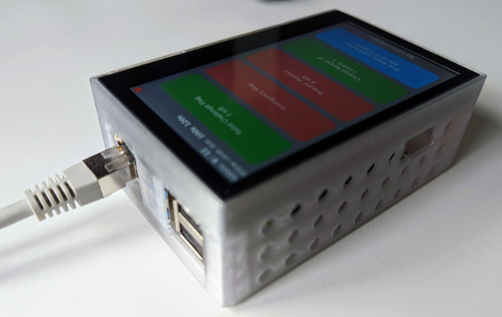
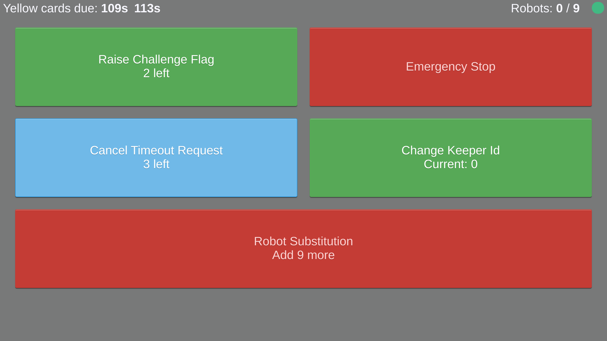

[](https://circleci.com/gh/RoboCup-SSL/ssl-remote-control/tree/master)
[](https://github.com/RoboCup-SSL/ssl-remote-control/releases/latest)

# ssl-remote-control

A remote control web app that can be used by the playing teams to send certain commands to the ssl-game-controller.

The SSL has multiple devices for the RoboCup:


Web Interface:


## Hardware
### Install on a Raspberry Pi
See [rpi/Readme.md](rpi/Readme.md)

### Additional hardware and housing
The remote-control is designed to run on a Raspberry Pi 3 or 4 with the following additional components:

 * Display: https://www.waveshare.com/product/4.3inch-dsi-lcd-with-case.htm
 * PoE HAT: https://www.rasppishop.de/RPi-PoE-HAT?shop=GH
 * Custom 3d-printed housing, see [doc/housing](./doc/housing)

## Usage
If you just want to use this app, simply download the latest [release binary](https://github.com/RoboCup-SSL/ssl-remote-control/releases/latest).
The binary is self-contained. No dependencies are required.

You can also use pre-build docker images:
```shell
docker pull robocupssl/ssl-remote-control
docker run -p 8084:8084 robocupssl/ssl-remote-control
```

By default, the UI is available at http://localhost:8084

## Development

### Requirements

You need to install following dependencies first:

* Go
* Node

See [.circleci/config.yml](.circleci/config.yml) for compatible versions.

### Frontend

See [frontend/README.md](frontend/README.md)

### Build
Build and install all binaries:

```shell
make install
```

### Run
Build and run main binary:

```shell
make run
```

### Update generated protobuf code
Generate the code for the `.proto` files after you've changed anything in a `.proto` file with:

```shell
make proto
```
